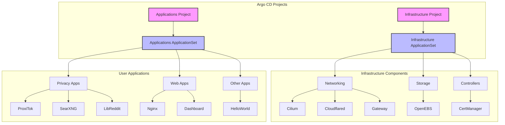

🚀 Kubernetes Starter Kit
===================

> Modern GitOps deployment structure using Argo CD on Kubernetes

This starter kit provides a production-ready foundation for deploying applications and infrastructure components using GitOps principles. Compatible with both Raspberry Pi and x86 systems.

## 📋 Table of Contents

- [Prerequisites](#-prerequisites)
- [Architecture](#-architecture)
- [Quick Start](#-quick-start)
  - [System Setup](#1-system-setup)
  - [K3s Installation](#2-k3s-installation)
  - [Networking Setup](#3-networking-setup-cilium)
  - [GitOps Setup](#4-gitops-setup-argo-cd-part-1-of-2)
- [Security Setup](#-security-setup)
  - [Cloudflare Integration](#cloudflare-integration)
- [Verification](#-verification)
- [Applications](#-included-applications)
- [Contributing](#-contributing)
- [License](#-license)

## 📋 Prerequisites

- Kubernetes cluster (tested with K3s v1.32.0+k3s1)
- Linux host (ARM or x86) with:
  - Storage support (OpenEBS works with ZFS or standard directories)
  - NFS and CIFS support (optional)
  - Open-iSCSI
- Cloudflare account (for DNS and Tunnel)

## 🏗️ Architecture

This repository follows a two-level GitOps structure using Argo CD ApplicationSets:



### Argo CD Structure

1. **Projects** (Resource Management & Security)
   - `infrastructure`: Core system components with cluster-wide permissions
   - `applications`: User applications with restricted permissions

2. **ApplicationSets** (Automated Application Creation)
   - `infrastructure-components`: Deploys core infrastructure (sync-wave: -2)
   - `applications`: Deploys user applications (sync-wave: 1)

3. **Sync Strategy**
   - Infrastructure deploys first (negative sync wave)
   - Applications deploy after infrastructure is ready
   - Automated sync with pruning and self-healing
   - Retry on failure with exponential backoff

This setup provides:
- Clear separation between infrastructure and applications
- Automated application discovery and deployment
- Security boundaries through projects
- Simplified onboarding for new applications
- Reliable deployment order through sync waves

## 🚀 Quick Start

### 1. System Setup

```bash
# Install required system packages if going to mount zfs storage or nfs or iscsi storage
sudo apt install zfsutils-linux nfs-kernel-server cifs-utils open-iscsi # (optional)
sudo apt install --reinstall zfs-dkms # (optional)
```

# workaround for cilium not loading packages, dependent upon OS
## https://docs.cilium.io/en/stable/operations/system_requirements/#linux-kernel
## https://github.com/cilium/cilium/issues/25021
modprobe iptable_raw
modprobe xt_socket

cat << 'EOF' > /etc/modules-load.d/cilium.conf
xt_socket
iptable_raw
EOF

### 2. K3s Installation

```bash
# IMPORTANT: Replace these values with your actual configuration
export SETUP_NODEIP=192.168.10.202
export SETUP_CLUSTERTOKEN=randomtokensecret1234323232

# Install K3s with custom configuration
curl -sfL https://get.k3s.io | INSTALL_K3S_VERSION="v1.32.0+k3s1" \
  INSTALL_K3S_EXEC="--node-ip $SETUP_NODEIP \
  --disable=flannel,local-storage,metrics-server,servicelb,traefik \
  --flannel-backend='none' \
  --disable-network-policy \
  --disable-cloud-controller \
  --disable-kube-proxy" \
  K3S_TOKEN=$SETUP_CLUSTERTOKEN \
  K3S_KUBECONFIG_MODE=644 sh -s -

# Setup kubeconfig
mkdir -p $HOME/.kube
sudo cp -i /etc/rancher/k3s/k3s.yaml $HOME/.kube/config
sudo chown $(id -u):$(id -g) $HOME/.kube/config
chmod 600 $HOME/.kube/config
```

### Setting Up Lens (Optional but Recommended)

1. Install Lens from https://k8slens.dev/
2. Get the kubeconfig:
   - Copy from `/etc/rancher/k3s/k3s.yaml`, or
   - Run: `kubectl config view --raw > kubeconfig.yaml`
3. When adding to Lens:
   - Replace the server URL with your K3s node IP
   - Example: `server: https://192.168.10.202:6443`
4. Save and connect

### 3. Networking Setup (Cilium)

```bash
# Install Cilium CLI
# Auto-detect architecture
CLI_ARCH=$(uname -m)
case $CLI_ARCH in
    x86_64)  CLI_ARCH="amd64" ;;
    aarch64) CLI_ARCH="arm64" ;;
    *)       echo "Unsupported architecture: $CLI_ARCH" && exit 1 ;;
esac

CILIUM_CLI_VERSION=$(curl -s https://raw.githubusercontent.com/cilium/cilium-cli/main/stable.txt)
curl -L --fail --remote-name-all https://github.com/cilium/cilium-cli/releases/download/${CILIUM_CLI_VERSION}/cilium-linux-${CLI_ARCH}.tar.gz
sudo tar xzvfC cilium-linux-${CLI_ARCH}.tar.gz /usr/local/bin
rm cilium-linux-${CLI_ARCH}.tar.gz

# Install Cilium with all configurations at once
# run from root of git repo
cd infrastructure/networking/cilium


cilium install -f values.yaml

# Verify Cilium is working
cilium status
cilium connectivity test
```

### 4. GitOps Setup (Argo CD) (PART 1 of 2)

```bash

# Install helm
curl https://raw.githubusercontent.com/helm/helm/main/scripts/get-helm-3 | bash

# cd to root of git repo
kubectl apply -k infrastructure/crds/gateway/


# Create argocd namespace
kubectl create namespace argocd

# Install Argo CD with custom configuration
kubectl kustomize --enable-helm infrastructure/controllers/argocd | kubectl apply -f -

# Apply Argo CD Projects for security boundaries
# run from root of git repo
kubectl apply -f infrastructure/controllers/argocd/projects.yaml

# Wait for Argo CD to be ready
kubectl wait --for=condition=Ready pod -l app.kubernetes.io/name=argocd-server -n argocd
```

## 🔒 Security Setup

### Cloudflare Integration

You'll need to create two secrets for Cloudflare integration:
1. DNS API Token for cert-manager (DNS validation)
2. Tunnel credentials for cloudflared (Tunnel connectivity)

#### 1. Create DNS API Token 🔑
```bash
# Navigate to Cloudflare Dashboard:
# 1. Profile > API Tokens
# 2. Create Token
# 3. Use "Edit zone DNS" template
# 4. Configure permissions:
#    - Zone - DNS - Edit
#    - Zone - Zone - Read
# 5. Set zone resources to your domain
# 6. Copy the token and your Cloudflare account email

# Set your credentials as environment variables (DO NOT COMMIT THESE VALUES)
export CLOUDFLARE_API_TOKEN="your-api-token-here"
export CLOUDFLARE_EMAIL="your-cloudflare-email"

#### 2. Setup Cloudflare Tunnel 🌐

# cd to home directory and run:
```bash
# Install cloudflared
brew install cloudflare/cloudflare/cloudflared  # macOS
# or
wget -q https://github.com/cloudflare/cloudflared/releases/latest/download/cloudflared-linux-amd64.deb
sudo dpkg -i cloudflared-linux-amd64.deb

# Login to Cloudflare (this will open a browser)
cloudflared tunnel login

# Set your domain (DO NOT COMMIT THIS VALUE)
export DOMAIN="yourdomain.com"
export TUNNEL_NAME="k3s-cluster"  # This should match the name in your config.yaml

# Create namespace for cloudflared
kubectl create namespace cloudflared

# Create the tunnel
cloudflared tunnel create $TUNNEL_NAME

# Get tunnel credentials and create Kubernetes secret
# IMPORTANT: Create this secret BEFORE deploying cloudflared
# run this from home directory:
cloudflared tunnel token --cred-file tunnel-creds.json $TUNNEL_NAME

# if you ls -all from your home directory, you will see a tunnel-creds.json file 

kubectl create secret generic tunnel-credentials \
  --namespace=cloudflared \
  --from-file=credentials.json=tunnel-creds.json

# Clean up credentials file ( optional )
rm tunnel-creds.json

# Configure DNS (*.yourdomain.com will point to your tunnel)
TUNNEL_ID=$(cloudflared tunnel list | grep $TUNNEL_NAME | awk '{print $1}')
cloudflared tunnel route dns $TUNNEL_ID "*.$DOMAIN"

# Verify your tunnel is created
cloudflared tunnel list
```

### CERT-MANAGER Prerequisites

```bash
# Create the cert-manager namespace
kubectl create namespace cert-manager

# Create the cloudflare-api-token secret
kubectl create secret generic cloudflare-api-token \
  --namespace cert-manager \
  --from-literal=api-token=$CLOUDFLARE_API_TOKEN \
  --from-literal=email=$CLOUDFLARE_EMAIL

# Verify the secret
kubectl get secret cloudflare-api-token -n cert-manager -o jsonpath='{.data.email}' | base64 -d
kubectl get secret cloudflare-api-token -n cert-manager -o jsonpath='{.data.api-token}' | base64 -d
```

### Argo CD Setup (PART 2 of 2)

```bash
# Run from root of git repo
kubectl apply -f infrastructure/controllers/argocd/projects.yaml -n argocd
kubectl apply -f infrastructure/infrastructure-components-appset.yaml -n argocd

# Verify deployments
kubectl get pods -n cert-manager
kubectl get pods -n cloudflared
kubectl get clusterissuer cloudflare-cluster-issuer -o wide
```

### Deploy Infrastructure and Applications

```bash

#apply gate
kubectl apply -k infrastructure/crds/gateway/

# Apply infrastructure ApplicationSet first
kubectl apply -f infrastructure/infrastructure-components-appset.yaml

# Wait for core infrastructure to be ready
kubectl wait --for=condition=Available deployment -l type=infrastructure --all-namespaces --timeout=300s

# Note: It will take 5-30 mins for cert manager certificates to be created

# Deploy applications (Argo CD PART 3 of 3)
kubectl apply -f my-apps/myapplications-appset.yaml
```

## 🔍 Verification

### Core Components
```bash
# Check all pods
kubectl get pods -A

# Check Argo CD applications
kubectl get applications -n argocd

# Check certificates
kubectl get certificates -A
kubectl get clusterissuer -A

# Check networking
cilium status
cilium connectivity test
```

### Application Access
- Argo CD UI: https://argocd.yourdomain.com
- ProxiTok: https://proxitok.yourdomain.com
- SearXNG: https://search.yourdomain.com
- LibReddit: https://reddit.yourdomain.com

## 📦 Included Applications

### Privacy Suite
- **ProxiTok**: Privacy-focused TikTok frontend
- **SearXNG**: Meta search engine
- **LibReddit**: Privacy-respecting Reddit frontend

### Infrastructure
- **Cilium**: CNI and service mesh
- **Gateway API**: Modern ingress controller
- **Cloudflared**: Secure tunnel to Cloudflare
- **OpenEBS**: Storage provisioner
- **cert-manager**: Certificate management

## 🤝 Contributing

Contributions are welcome! Please feel free to submit a Pull Request.

## 📝 License

This project is licensed under the MIT License - see the LICENSE file for details.

## 🔧 Troubleshooting

### Common Issues

1. **Certificates Not Issuing**
   - Check Cloudflare API token permissions
   - Verify cert-manager pods are running
   - Check cert-manager logs: `kubectl logs -n cert-manager -l app=cert-manager`

2. **Cloudflare Tunnel Issues**
   - Verify tunnel status: `cloudflared tunnel list`
   - Check tunnel logs: `kubectl logs -n cloudflared -l app=cloudflared`

3. **Cilium Connectivity Issues**
   - Run connectivity test: `cilium connectivity test`
   - Check Cilium status: `cilium status --verbose`
   - Verify Hubble UI access: `cilium hubble ui`