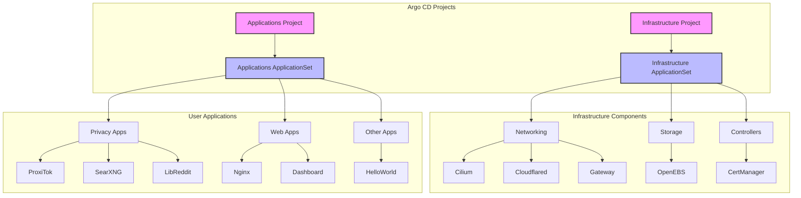

🚀 Kubernetes Starter Kit
===================

> Modern GitOps deployment structure using Argo CD on Kubernetes

This starter kit provides a production-ready foundation for deploying applications and infrastructure components using GitOps principles. Compatible with both Raspberry Pi and x86 systems.

## 📋 Prerequisites

- Kubernetes cluster (tested with K3s v1.32.0+k3s1)
- Linux host (ARM or x86) with:
  - Storage support (OpenEBS works with ZFS or standard directories)
  - NFS and CIFS support (optional)
  - Open-iSCSI
- Cloudflare account (for DNS and Tunnel)

## 🏗️ Architecture

This repository follows a two-level GitOps structure using Argo CD ApplicationSets:



### Argo CD Structure

1. **Projects** (Resource Management & Security)
   - `infrastructure`: Core system components with cluster-wide permissions
   - `applications`: User applications with restricted permissions

2. **ApplicationSets** (Automated Application Creation)
   - `infrastructure-components`: Deploys core infrastructure (sync-wave: -2)
   - `applications`: Deploys user applications (sync-wave: 1)

3. **Sync Strategy**
   - Infrastructure deploys first (negative sync wave)
   - Applications deploy after infrastructure is ready
   - Automated sync with pruning and self-healing
   - Retry on failure with exponential backoff

### Bootstrap Process

1. **Install Argo CD**
```bash
# Create argocd namespace
kubectl create namespace argocd

# Apply Argo CD Projects
kubectl apply -f infrastructure/controllers/argocd/projects.yaml

# Install Argo CD with custom configuration
kubectl kustomize --enable-helm infrastructure/controllers/argocd | kubectl apply -f -

# Wait for Argo CD to be ready
kubectl wait --for=condition=Ready pod -l app.kubernetes.io/name=argocd-server -n argocd
```

2. **Deploy ApplicationSets**
```bash
# Apply infrastructure ApplicationSet first
kubectl apply -f infrastructure/infrastructure-components-appset.yaml

# Wait for core infrastructure to be ready
kubectl wait --for=condition=Available deployment -l type=infrastructure --all-namespaces --timeout=300s

# Apply applications ApplicationSet
kubectl apply -f my-apps/myapplications-appset.yaml
```

This setup provides:
- Clear separation between infrastructure and applications
- Automated application discovery and deployment
- Security boundaries through projects
- Simplified onboarding for new applications
- Reliable deployment order through sync waves

## 🚀 Quick Start

### 1. System Setup

```bash
# Install required system packages
sudo apt install zfsutils-linux nfs-kernel-server cifs-utils open-iscsi
sudo apt install --reinstall zfs-dkms
```

### 2. K3s Installation

```bash
# IMPORTANT: Replace these values with your actual configuration
export SETUP_NODEIP=192.168.100.176
export SETUP_CLUSTERTOKEN=randomtokensecret1234

# Install K3s with custom configuration
curl -sfL https://get.k3s.io | INSTALL_K3S_VERSION="v1.32.0+k3s1" \
  INSTALL_K3S_EXEC="--node-ip $SETUP_NODEIP \
  --disable=flannel,local-storage,metrics-server,servicelb,traefik \
  --flannel-backend='none' \
  --disable-network-policy \
  --disable-cloud-controller \
  --disable-kube-proxy" \
  K3S_TOKEN=$SETUP_CLUSTERTOKEN \
  K3S_KUBECONFIG_MODE=644 sh -s -

# Setup kubeconfig
mkdir -p $HOME/.kube
sudo cp -i /etc/rancher/k3s/k3s.yaml $HOME/.kube/config
sudo chown $(id -u):$(id -g) $HOME/.kube/config
chmod 600 $HOME/.kube/config
```

### 3. Networking Setup (Cilium)

```bash
# Install Cilium CLI
# Replace ARCH with arm64 or amd64
CILIUM_CLI_VERSION=$(curl -s https://raw.githubusercontent.com/cilium/cilium-cli/main/stable.txt)
CLI_ARCH=arm64
curl -L --fail --remote-name-all https://github.com/cilium/cilium-cli/releases/download/${CILIUM_CLI_VERSION}/cilium-linux-${CLI_ARCH}.tar.gz
sudo tar xzvfC cilium-linux-${CLI_ARCH}.tar.gz /usr/local/bin
rm cilium-linux-${CLI_ARCH}.tar.gz

# Install Cilium with all configurations at once
cd infrastructure/networking/cilium

# Option 1: Version in values file (recommended)
# Add this to your cilium-values.yaml:
# image:
#   tag: "v1.16.5"
cilium install -f cilium-values.yaml

# Option 2: Version via CLI (not recommended for GitOps)
# cilium install --version v1.16.5 -f cilium-values.yaml

# Verify Cilium is working
cilium status
cilium connectivity test
```

### 4. GitOps Setup (Argo CD)

```bash
# Create argocd namespace
kubectl create namespace argocd

# Apply Argo CD Projects for security boundaries
kubectl apply -f infrastructure/controllers/argocd/projects.yaml

# Install Argo CD with custom configuration
kubectl kustomize --enable-helm infrastructure/controllers/argocd | kubectl apply -f -

# Wait for Argo CD to be ready
kubectl wait --for=condition=Ready pod -l app.kubernetes.io/name=argocd-server -n argocd
```

## 🔒 Security Setup

### Cloudflare Integration

You'll need to create two secrets for Cloudflare integration:
1. DNS API Token for cert-manager (DNS validation)
2. Tunnel credentials for cloudflared (Tunnel connectivity)

#### 1. Create DNS API Token 🔑
```bash
# Navigate to Cloudflare Dashboard:
# 1. Profile > API Tokens
# 2. Create Token
# 3. Use "Edit zone DNS" template
# 4. Configure permissions:
#    - Zone - DNS - Edit
#    - Zone - Zone - Read
# 5. Set zone resources to your domain
# 6. Copy the token and your Cloudflare account email

# Set your credentials as environment variables (DO NOT COMMIT THESE VALUES)
export CLOUDFLARE_API_TOKEN="your-api-token-here"
export CLOUDFLARE_EMAIL="your-cloudflare-email"

# First, create the cert-manager namespace if it doesn't exist
kubectl create namespace cert-manager

# IMPORTANT: Create the cloudflare-api-token secret BEFORE deploying cert-manager
kubectl create secret generic cloudflare-api-token \
  --namespace cert-manager \
  --from-literal=api-token=$CLOUDFLARE_API_TOKEN \
  --from-literal=email=$CLOUDFLARE_EMAIL

# Verify the secret is created with correct data
kubectl get secret cloudflare-api-token -n cert-manager -o jsonpath='{.data.email}' | base64 -d
kubectl get secret cloudflare-api-token -n cert-manager -o jsonpath='{.data.api-token}' | base64 -d
```

#### 2. Setup Cloudflare Tunnel 🌐
```bash
# Install cloudflared
brew install cloudflare/cloudflare/cloudflared  # macOS
# or
wget -q https://github.com/cloudflare/cloudflared/releases/latest/download/cloudflared-linux-amd64.deb
sudo dpkg -i cloudflared-linux-amd64.deb

# Login to Cloudflare (this will open a browser)
cloudflared tunnel login

# Set your domain (DO NOT COMMIT THIS VALUE)
export DOMAIN="yourdomain.com"
export TUNNEL_NAME="k3s-cluster"  # This should match the name in your config.yaml

# Create namespace for cloudflared
kubectl create namespace cloudflared

# Create the tunnel
cloudflared tunnel create $TUNNEL_NAME

# Get tunnel credentials and create Kubernetes secret
# IMPORTANT: Create this secret BEFORE deploying cloudflared
cloudflared tunnel token --cred-file tunnel-creds.json $TUNNEL_NAME
kubectl create secret generic tunnel-credentials \
  --namespace=cloudflared \
  --from-file=credentials.json=tunnel-creds.json

# Clean up credentials file
rm tunnel-creds.json

# Configure DNS (*.yourdomain.com will point to your tunnel)
TUNNEL_ID=$(cloudflared tunnel list | grep $TUNNEL_NAME | awk '{print $1}')
cloudflared tunnel route dns $TUNNEL_ID "*.$DOMAIN"

# Verify your tunnel is created
cloudflared tunnel list
```

### Deployment Order and Verification

The correct order for deploying components is:

1. Create necessary namespaces:
```bash
kubectl create namespace cert-manager
kubectl create namespace cloudflared
```

2. Create required secrets (BEFORE deploying any components):
```bash
# Create cert-manager secret
kubectl create secret generic cloudflare-api-token \
  --namespace cert-manager \
  --from-literal=api-token=$CLOUDFLARE_API_TOKEN \
  --from-literal=email=$CLOUDFLARE_EMAIL

# Create cloudflared tunnel credentials
cloudflared tunnel create $TUNNEL_NAME
cloudflared tunnel token --cred-file tunnel-creds.json $TUNNEL_NAME
kubectl create secret generic tunnel-credentials \
  --namespace=cloudflared \
  --from-file=credentials.json=tunnel-creds.json
rm tunnel-creds.json
```

3. Deploy infrastructure using Argo CD:
```bash
kubectl apply -f infrastructure/infrastructure-components-appset.yaml -n argocd
```

4. Verify the deployments:
```bash
# Check cert-manager
kubectl get pods -n cert-manager

# Check cloudflared
kubectl get pods -n cloudflared

# Check ClusterIssuer status
kubectl get clusterissuer cloudflare-cluster-issuer -o wide
```

After completing these steps, you'll have:
1. A cert-manager secret with your Cloudflare API token and email
2. A cloudflared secret with your tunnel credentials
3. DNS routing configured for your domain through the tunnel

## 🔍 Verification

```bash
# Check core components
kubectl get pods -A
kubectl get applicationsets -n argocd
kubectl get applications -n argocd

# Verify certificates
kubectl get clusterissuer cloudflare-cluster-issuer -o wide
kubectl get certificates -A

# Check network connectivity
cilium status
cilium connectivity test
```

## 📦 Included Applications

### Privacy Suite
- **ProxiTok**: Privacy-focused TikTok frontend
- **SearXNG**: Meta search engine
- **LibReddit**: Privacy-respecting Reddit frontend

### Infrastructure
- **Cilium**: CNI and service mesh
- **Gateway API**: Modern ingress controller
- **Cloudflared**: Secure tunnel to Cloudflare
- **OpenEBS**: Storage provisioner
- **cert-manager**: Certificate management

## 🤝 Contributing

Contributions are welcome! Please feel free to submit a Pull Request.

## 📝 License

This project is licensed under the MIT License - see the LICENSE file for details.